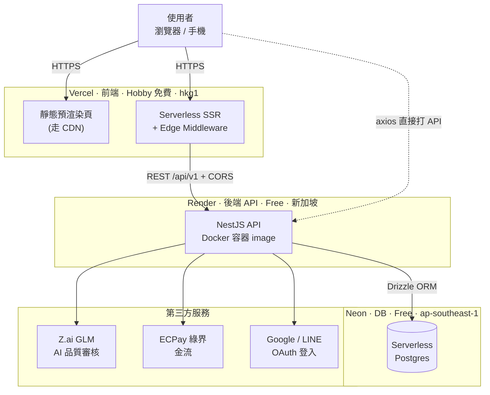

# 券問 QuanWen — 系統架構總覽

> 線上問卷獎勵平台。**三層全分離、三家供應商、目前全部免費方案。**
> 延伸閱讀：[[部署架構與供應商]]、[[部署流程 (GitHub Actions 閘門)]]、[[多-Agent 並行開發]]

---

## 全景架構圖

---

## 一句話摘要

| 層 | 供應商 | 性質 | 方案 | 詳見 |
|----|--------|------|------|------|
| 前端 | Vercel | PaaS / 前端 serverless | Hobby（免費） | [[部署架構與供應商#前端 Vercel]] |
| 後端 API | Render | PaaS 跑 Docker 容器（偏 CaaS） | Free | [[部署架構與供應商#後端 API Render]] |
| 資料庫 | Neon | DBaaS（serverless Postgres） | Free | [[部署架構與供應商#資料庫 Neon]] |

- **基礎設施月費 ≈ $0**，唯一變動成本是 Z.ai AI 調用（GLM 一次約 NT$0.17）。
- **前後端完全分離**：不同平台、不同網域、不同部署管線，靠 HTTPS + CORS 溝通。
- **冷啟動是免費方案最大痛點** → 見 [[部署架構與供應商#冷啟動 cold start]]。

---

## 正式環境網址

- 前端：https://quanwen.vercel.app
- 後端 API：https://quanwen-api.onrender.com （health 在**根路徑** `/health`）
- 程式碼：`/home/aa/projects/quanwen`（monorepo：`apps/web` + `apps/api`）

## 關聯筆記

- [[部署架構與供應商]] — 三層細節、方案、冷啟動
- [[部署流程 (GitHub Actions 閘門)]] — CI/CD 如何防多 session 互蓋
- [[多-Agent 並行開發]] — parallel-code worktree 工作流
