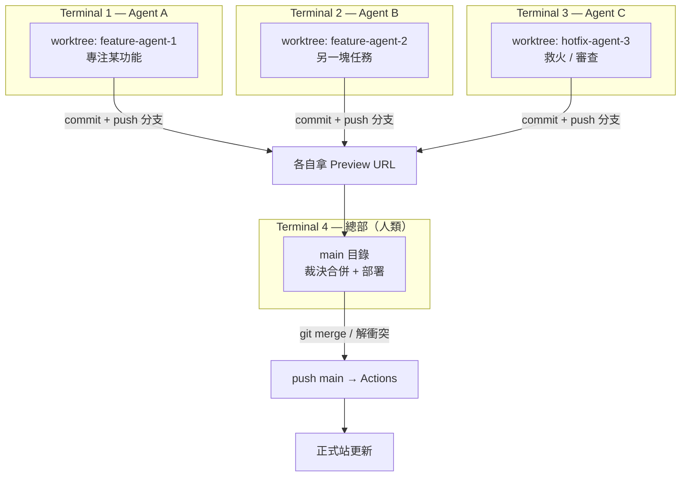

# 多-Agent 並行開發 (parallel-code)

> 上層：[[券問架構總覽]] ｜ 相關：[[部署流程 (GitHub Actions 閘門)]]
> 工具：[johannesjo/parallel-code](https://github.com/johannesjo/parallel-code)

---

## 概念

用 **git worktree** 把多個 AI agent 隔離：每個 agent 在自己的資料夾 + 分支工作，改壞也只爛在自己那份。完成後 commit，由「總部」(Terminal 4 / 人類) 裁決合併。

---

## 為什麼這套對 券問 特別合適

worktree 隔離 +（已建好的）[[部署流程 (GitHub Actions 閘門)]] 剛好是互補的兩半：

| 風險 | 解法 |
|------|------|
| 並行 agent 改檔互相污染共用工作樹 | **worktree 隔離**（各自資料夾） |
| 並行 agent 部署互相覆蓋正式站 | **Actions 閘門**（agent 碰不到 production，只有 merge main 才上線） |

合起來：agent 各自改 → 各自分支拿 Preview 驗 → Terminal 4 裁決 merge → 自動上線。**Terminal 4 = 唯一序列化點。**

---

## 套到 quanwen 必須先處理的坑

1. **共用工作樹現有未 commit WIP**：切 worktree 模式前，主目錄髒檔要先清（commit 或丟棄），否則混淆「哪些是誰的」。
2. **pnpm monorepo 的 node_modules 不能裸 symlink 共用**：`.pnpm` 虛擬 store 是路徑綁定的。**每個新 worktree 各自 `pnpm install`**（全域 content store，重裝快）。
3. **API 部署還沒進閘門**：多 agent 同改 `apps/api` 仍會互蓋 image → 紀律上 API 只從 main 部署。
4. **Preview 配額**：現在任意非 main 分支 push 都出 Preview，多 agent 高頻 commit 會大量 build；額度吃緊可改成只在開 PR 時出 Preview。

---

## 落地順序

1. 清掉主目錄 WIP
2. parallel-code 指向 repo，agent 分支從 **main** 開（才繼承 workflow）
3. 每個 worktree 各自 `pnpm install`
4. agent commit → 看 Preview → Terminal 4 merge main → 自動上線

---

## 關聯

- [[券問架構總覽]]
- [[部署流程 (GitHub Actions 閘門)]] — merge main 後的自動部署
- [[部署架構與供應商]]
