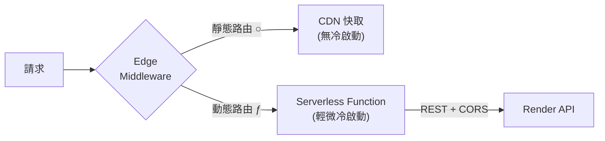
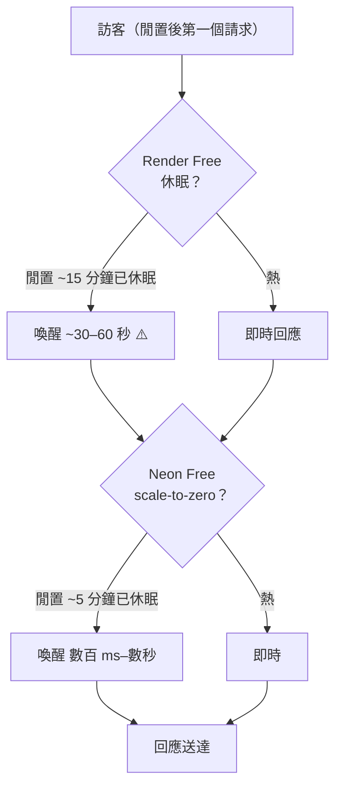

# 部署架構與供應商

> 上層：[[券問架構總覽]] ｜ 相關：[[部署流程 (GitHub Actions 閘門)]]
> 以下數據為 2026-06-08 實際打 API 確認，非憑記憶。

---

## CaaS 還是 PaaS？

**以 PaaS 為主，API 那層偏 CaaS：**
- **Render** 本身是 PaaS，但我們用「部署現成 Docker image」模式（`env: image`，跑 `me0608623/quanwen-api:latest`）→ 把容器丟給平台跑，最接近 **CaaS（容器即服務）**。
- **Vercel** 是純 PaaS / 前端 serverless 平台。
- **Neon** 是 **DBaaS**（代管資料庫）。

---

## 前端 (Vercel)

- **方案**：Hobby（免費）；team `409500476's projects`。
- **不是純靜態**，是「靜態預渲染 + serverless SSR」混合：
  - 首頁 `/` → `x-vercel-cache: HIT`，靜態頁走 CDN（Next.js `○`）
  - `/tasks/[id]` → `cache-control: max-age=0`，serverless function 動態渲染（`ƒ`）
  - 另有一個 Edge Middleware
- **部署**：改 `apps/web` → 走 [[部署流程 (GitHub Actions 閘門)]]（**禁止本機 `vercel --prod`**）。
- `NEXT_PUBLIC_*` 是 build-time 烘進去的 → 改 env 必須重部署。

---

## 後端 API (Render)

- **方案**：Free；type `web_service`；region **新加坡**；`numInstances: 1`；`autoDeploy: no`。
- **runtime**：`image` — 跑 Docker Hub 的 `me0608623/quanwen-api:latest`（NestJS）。
- **部署**：改 `apps/api` → `docker build` + `docker push` + 觸發 Render redeploy（用 `RENDER_API_KEY` / `RENDER_SERVICE_ID`，存 `/home/aa/.config/quanwen/secrets.env`）。
- ⚠️ **image 是 last-push-wins** → 多人改 API 會互蓋，build 前要確認 HEAD 含所有已部署 commits。**尚未進 Actions 閘門**（前端已進）。

---

## 資料庫 (Neon)

- **方案**：Free；serverless Postgres；region **ap-southeast-1（新加坡）**。
- 跟 Vercel、Render 都獨立。API 用 **Drizzle ORM** 連線。
- schema 同步：`cd apps/api && DATABASE_URL=$NEON_DATABASE_URL npx drizzle-kit push`。
- 開發另有 **PGlite in-memory** 模式（`USE_PG_MEM=true`），無需連 Neon。

---

## Redis

**無。** Throttler（限流）在沒有 Redis 時自動降級成 in-memory。多實例擴張時才需要補。

---

## 冷啟動 cold start

**有，且是免費方案最大 UX 痛點。** 兩處會冷啟動疊加：

| 服務 | 休眠條件 | 喚醒時間 | 嚴重度 |
|------|---------|---------|--------|
| Render Free | 閒置 ~15 分鐘 | **~30–60 秒** | 🔴 高 |
| Neon Free | 閒置 ~5 分鐘 scale-to-zero | 數百 ms–數秒 | 🟡 中 |
| Vercel serverless | 函式冷啟動 | ms–1~2 秒 | 🟢 低 |
| Vercel 靜態頁 | 走 CDN | 無 | ⚪ 無 |

**解法選項**：
1. 升級 Render 付費方案（常駐不休眠）— 最乾淨但要錢。
2. 外部 cron 每 ~10 分鐘 ping `/health` 保溫 — 治標，且會吃掉 Render Free 每月運行時數上限。
3. 接受冷啟動 — 流量起來自然變熱。

---

## 關聯

- [[券問架構總覽]] — 全景圖
- [[部署流程 (GitHub Actions 閘門)]] — 前端如何安全部署
- [[多-Agent 並行開發]] — 多人/多 agent 怎麼不互相踩
