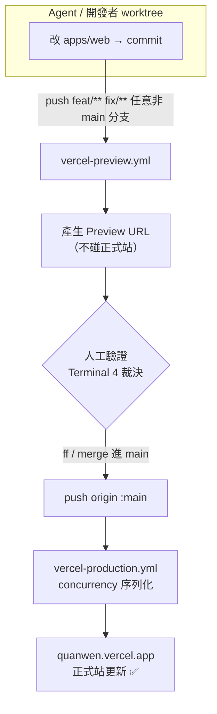

# 部署流程 (GitHub Actions 閘門)

> 上層：[[券問架構總覽]] ｜ 相關：[[部署架構與供應商]]、[[多-Agent 並行開發]]
> 2026-06-08 建立。解決「多 session / 多 agent 並行部署互相覆蓋正式站」。

---

## 為什麼要這個閘門

Vercel 部署是**快照上傳、最後一個贏**，沒有合併概念。
若 Session A 從舊 commit 部署，會把 Session B 已上線的改動**回滾**。靠「自律從乾淨 worktree 部署」不可靠。

**解法**：把部署權從本機 CLI 收回 GitHub Actions，**只有 `main` 分支能更新正式站**。

---

## 前端部署流程（已上線）

### 關鍵設定
- `apps/web/vercel.json` → `"git": { "deploymentEnabled": false }`（關掉 Vercel 自動部署）
- `.github/workflows/vercel-production.yml` → push `main` → production（`PRODUCTION: true`）
- `.github/workflows/vercel-preview.yml` → `branches-ignore: [main, develop]` → 任意分支出 Preview
- repo secrets：`VERCEL_TOKEN`（**後台長期 Access Token，非 CLI auth.json**）、`VERCEL_ORG_ID`、`VERCEL_PROJECT_ID`

### 為什麼這樣不會互蓋
production 永遠從 `main` tip 建置。要更新正式站只能 ff `main`，而 **git 會拒絕落後的 push** → 兩個 session 不可能同時把不同快照推上 production。`concurrency: vercel-production` 再保證不會兩個部署互搶。

---

## 踩過的 3 個坑

| 坑 | 症狀 | 解法 |
|----|------|------|
| workflow `GITHUB_TOKEN` 預設唯讀 | `Resource not accessible by integration` | 加 `permissions: deployments/pull-requests write` |
| runner 沒 vercel CLI | `spawn vercel ENOENT` | 先 `npm install -g vercel` step |
| **token 類型**（最坑） | 設後幾分鐘可動、~12h 後失效（API 403） | `auth.json` 是會輪替的 OAuth token；**必須用後台建的長期 Access Token**（`vcp_` 開頭） |

---

## 後端 API 部署（尚未進閘門）

`apps/api` 仍是手動：`docker build` → `docker push me0608623/quanwen-api:latest` → 觸發 Render redeploy。
⚠️ image 也是 **last-push-wins**，多 agent 改 API 仍會互蓋。
**短期紀律**：API 也只從 `main` 部署。**長期**：建議比照前端搬進 Actions（push main → build+push image → 觸發 Render）。

---

## 關聯

- [[券問架構總覽]]
- [[部署架構與供應商]] — 供應商與方案
- [[多-Agent 並行開發]] — 這個閘門搭配 worktree 隔離才完整
